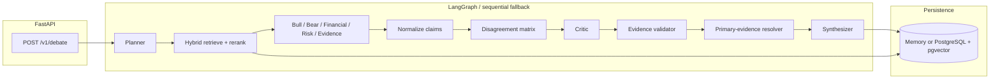

# Architecture

Evidence-driven multi-agent debate over a frozen synthetic SEC-style corpus.

## Design rules

1. Deterministic Python owns numbers, disagreement, validation, and termination.
2. The LLM provider is behind `LLMProvider`; the default `heuristic` adapter does not invent facts.
3. Specialists share a fact pool and *select* differently. They are not one prompt with five labels.
4. Unresolved disagreements remain unresolved.
5. Single-agent RAG is a first-class baseline, not a slide.

## Package map

| Package | Responsibility |
|---|---|
| `domain/` | enums, errors, Pydantic contracts |
| `services/` | planner, facts, specialists, matrix, critic, validator, synthesis |
| `agents/` | bounded policy, node catalog, LangGraph wiring |
| `tools/` | typed retrieve + YoY with RBAC |
| `models/` | LLM, embeddings, reranker |
| `repositories/` | memory / postgres |
| `api/` | envelope, health, debate, eval, admin |
| `evaluation/` | harness and metrics |

## Persistence

Tables (see `docs/data_model.md`): `research_runs`, `run_events`, `audit_events`, `evaluation_results`.
Default demo store is in-memory so a clean laptop can run without Docker. Compose still ships Postgres + Redis.
