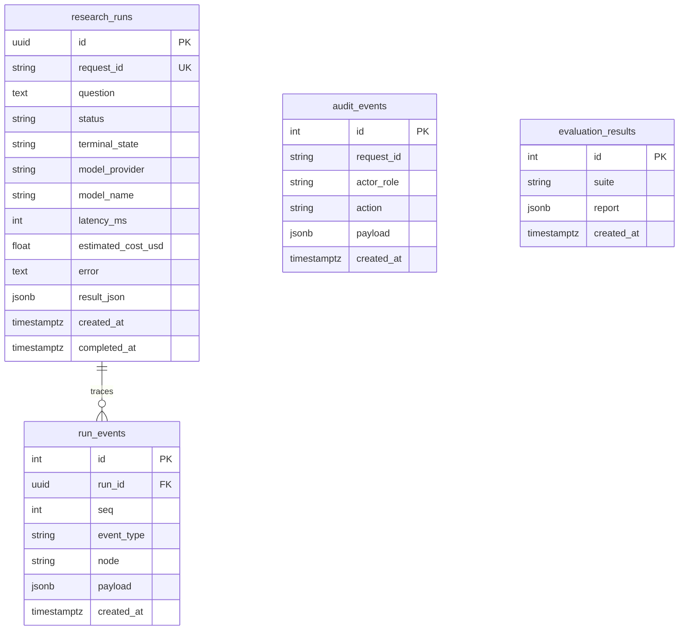

# Data model

| Table | Purpose | PK | FKs | Indexes | Sensitive | Retention |
|---|---|---|---|---|---|---|
| `research_runs` | One debate | `id` UUID | — | `request_id` unique, `status` | question text, result JSON | Operator-defined; demo keeps all |
| `run_events` | Trace | `id` serial | `run_id → research_runs` | `run_id`, `event_type` | payloads may include snippets | Same as parent run |
| `audit_events` | Consequential actions | `id` serial | — | `request_id`, `action` | actor role | Longer than runs |
| `evaluation_results` | Harness output | `id` serial | — | `suite` | none expected | Keep latest per suite |

No secrets belong in these tables. API tokens stay in the environment. The in-memory repository implements the same contract for laptop demos without Postgres.
