# Evaluation notes

Run `make eval`. The harness writes `evaluation/reports/regression.json`.
That file is produced by the run; it is not hand-written.

Measured 2026-09-19 on the heuristic provider (6 regression items):

```mermaid
xychart-beta
    title "Regression suite: multi-agent vs single-agent"
    x-axis ["accuracy", "correctness", "contradiction"]
    y-axis "score" 0 --> 1
    bar [0.75, 0.77, 0.67]
    bar [0.75, 0.75, 0.33]
```

| Metric | Multi-agent | Single-agent |
|---|---|---|
| Evidence-supported accuracy | 0.75 | 0.75 |
| Final correctness | 0.77 | 0.75 |
| Contradiction detection | 0.67 | 0.33 |
| p50 latency | 7 ms | ~0 ms |
| Estimated cost (heuristic) | $0.0005 | $0.00 |

Honest conclusion: the debate layer earns its keep on *conflict visibility*, not on extracting more gold numbers from this small corpus.

Comparison question the portfolio should answer honestly:

> Does contradiction detection and citation preference for 10-Q/10-K justify
> extra retrieval calls versus single-agent RAG?

On the heuristic provider, token *cost* is near zero (no vendor bill). Latency
and redundant-tool metrics are still real. When `LLM_PROVIDER=openai`, cost
deltas become meaningful. That path is wired (`OpenAILLMProvider`) and is not
claimed as measured until a key is provided and `make eval` is re-run.

Full suite (`make eval-full`, 10 items, same checkout):

| Metric | Multi-agent | Single-agent |
|---|---|---|
| Evidence-supported accuracy | 0.82 | 0.67 |
| Final correctness | 0.83 | 0.67 |
| Contradiction detection | 0.56 | 0.40 |
| p50 latency | 13 ms | ~0 ms |

JSON: `evaluation/reports/latest.json`.

Grafana panels for live metrics: `deployment/observability/grafana-debate.json`.
Load-test output: `docs/load_test.md`.
