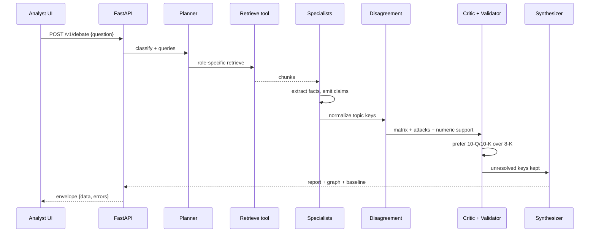

# Sequence — main debate

```mermaid
sequenceDiagram
  participant U as Analyst UI
  participant A as FastAPI
  participant P as Planner
  participant T as Retrieve tool
  participant B as Specialists
  participant D as Disagreement
  participant C as Critic + Validator
  participant S as Synthesizer
  U->>A: POST /v1/debate {question}
  A->>P: classify + queries
  P->>T: role-specific retrieve
  T-->>B: chunks
  B->>B: extract facts, emit claims
  B->>D: normalize topic keys
  D->>C: matrix + attacks + numeric support
  C->>C: prefer 10-Q/10-K over 8-K
  C->>S: unresolved keys kept
  S-->>A: report + graph + baseline
  A-->>U: envelope {data, errors}
```

Failure shortcuts: invalid input never enters the graph; provider/tool/database failures map to typed terminal states and HTTP codes (`docs/failure_modes.md`).
